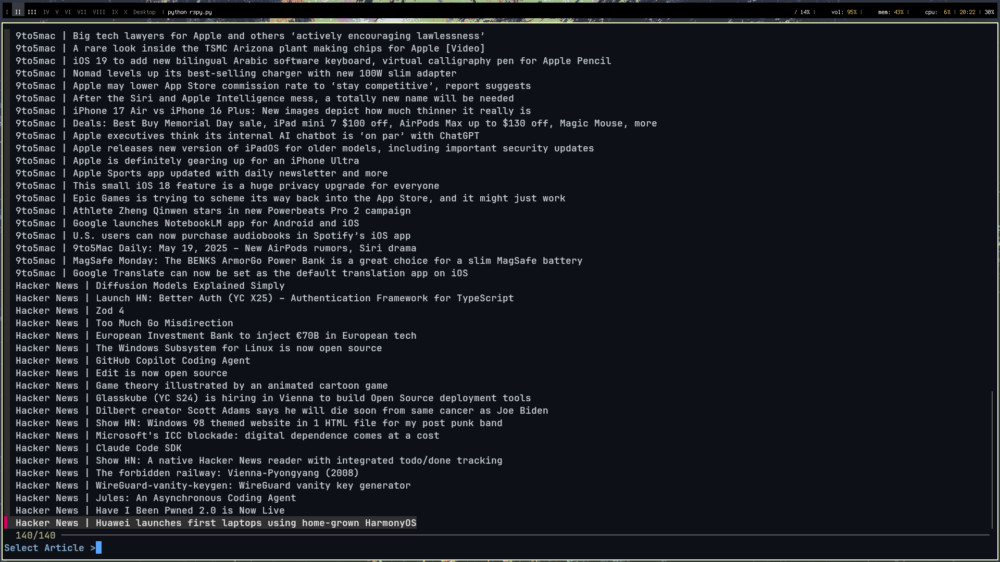
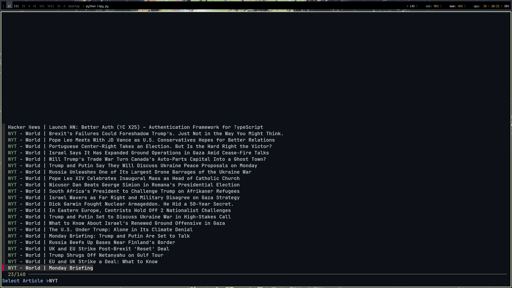

```
  _____     _ ___           _ 
 |_   _|  _(_) __|__ ___ __| |
   | || || | | _/ -_) -_) _` |
   |_| \_,_|_|_|\___\___\__,_|
```
                            
A personal aggregator of rss feeds, take your terminal and track feeds without needing too much unnecessary adornment.


|   Reasons for use |
| ------------ | 
|Support for various types of feed|   
|Rapidity|
|Cache and Parallel Downloads|

### What do i need?

1. A browser like [firefox](https://www.mozilla.org/pt-BR/firefox/new/ "firefox")
2.  A terminal emulator like  [alacritty](https://alacritty.org/)
3. Python installed
4. feedparser library
5. [fzf](https://github.com/junegunn/fzf)

```bash
pip install feedparser requests listparser
```

### Configuring
> Create e directory ~/.config/tuifeed/ and after create your config.json like this: 

    {
      "feeds": [
        {
          "name": "Hacker News",
          "url": "https://hnrss.org/frontpage"
        },
    
        {
          "name": "9to5Mac",
          "url": "9to5mac.com/rss"
        },
      ]
    }
    
This is the current configuration example, probably changes for efficiency will be made.


### Importing feeds
```bash
tuifeed -p feeds.opml
```

### Images


